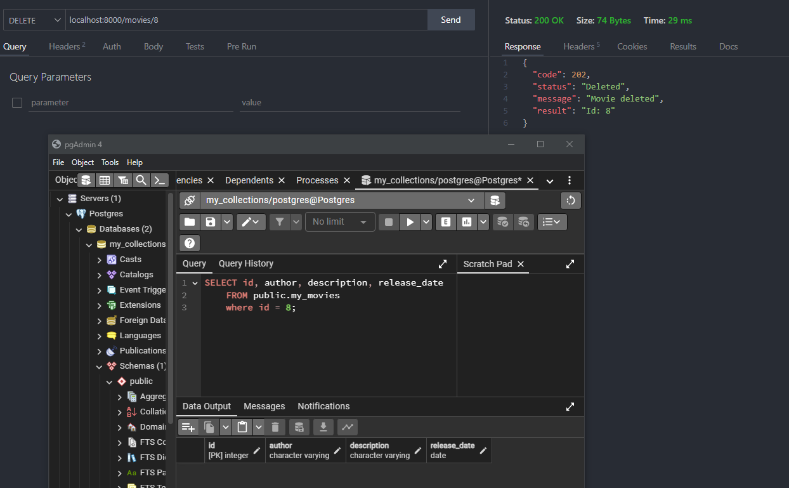

# Movies FastAPI

Simple API using FastAPI, Python and PostgreSQL

FastAPI is a web framework for building APIs with Python. In this project I built an API with **CRUD** operations and high performance.

## Before you begin

Make sure you've previouslly installed Python on your OS, this API uses Python 3.12.

If you want to deploy the application once you're done building it, the common aproach is to build a Linux container image using Docker. Also, you can run PostgreSQL from a container, so installing Docker is highly recommended.

At last but not least, is a good idea to install both database and API clients, such as PgAdmin and ThunderClient for VSCode.

## Libraries

- [fastapi](https://fastapi.tiangolo.com/)
- [sqlalchemy](https://www.sqlalchemy.org/)
- [psycopg2](https://pypi.org/project/psycopg2/)

## Setting up the project structure

Create a new directory called `app/`. In this path you can put all files realted to the API.

The `main.py` file is the starting point to import libraries, modules and different utilities. You can name your modules whatever you feel like and remember to create an `__init.py__` file everytime you generate a new directory inside the `app/` path.

```
.
├── app
│   ├── main.py
│   ├── ...
│   ├── schemas
│   │   ├── __init__.py
│   │   └── ...
│   └── models
│       ├── __init__.py
│       └── ...
```

Finally, you need to create two files at the project's root path level:

- Dockerfile
- requirements.txt

The final result should look like the following structure:

```
.
├── app
│   ├── main.py
│   └── ...
├── Dockerfile
└── requirements.txt
```

## Database container

A `docker-compose.yml` file is provided in this project in case that you desire to run the database from a Docker container.

```bash
╰─ docker-compose up
```

Building the database container with **docker compose** is completely optional. If you already have a local machine or a cloud service running PostgreSQL, then you can definitely reuse it. Just keep in mind that you require your database IP address.

## Dev Environment

To set up the dev environment, follow the next stepts:

1. Install virtual environment and web server dependencies:

```bash
pip install virtualenv
pip install uvicorn
```

2. Generete a new virtual environment:

```bash
╰─ Unix/macOS:
python3 -m venv .venv

╰─ Windows
py -m venv .venv
```

3. Activate the virtual environment

```bash
╰─ Unix/macOS:
source .venv/bin/activate

╰─ Windows
.venv\Scripts\activate
```

4. Install dependencies

```bash
pip install -r requirements.txt
```

5. Initiate Uvicorn

```bash
cd app
uvicorn main:app --reload
```

## Build the Docker image

Once you finish your API, you can build a Docker image to deploy your app.

Go to the project directory in where your Dockerfile is and type:

```bash
╰─ docker build -t myimage .
```

### Start the Docker Container

Run a container based on your image:

```bash
╰─ docker run -d --name mycontainer -p 80:80 myimage
```


### Check your application working

You should be able to check it in your Docker container's URL, for example:

- http://192.168.99.100/docs


### Container's IP address

If you have both your app and dabase containers running on the same machine, then you need to get the real IP address from the database container. This is due to the default network mode on Docker, **bridge**.

Once you've gotten the IP addres, set it up in `database.py`.

If you are running tests on your local machine while using web servers like **Uvicorn**, switch the IP address back to `localhost` in `database.py`.

```bash
╰─ docker ps

CONTAINER ID   IMAGE      COMMAND                  CREATED       STATUS          PORTS                    NAMES
a80117d31c68   postgres   "docker-entrypoint.s…"   3 weeks ago   Up 16 seconds   0.0.0.0:5432->5432/tcp   postgres

╰─ docker inspect postgres

[
    {
        "Id": "a80117d31c680073c77cf5ca7ab56a034193e04eabb0c55805eff56b902d53ab",
        "Created": "2024-04-24T02:07:16.110059554Z",
        "Path": "docker-entrypoint.sh",
        "Args": [
            "postgres"
        ],
        "State": {
            "Status": "running",
            "Running": true,
            "Paused": false,
            "Restarting": false,
            "OOMKilled": false,
            "Dead": false,
            "Pid": 362,
            "ExitCode": 0,
            "Error": "",
            "StartedAt": "2024-05-16T06:33:40.41262039Z",
            "FinishedAt": "2024-05-15T03:23:33.567499664Z"
        },
        "NetworkSettings": {
            "Bridge": "",
            "SandboxID": "a9ecb0d79e3ce60d22deffee7c89c5b6f441583a69232c85fadd110c974d2c31",
            "SandboxKey": "/var/run/docker/netns/a9ecb0d79e3c",
            "Ports": {
                "5432/tcp": [
                    {
                        "HostIp": "0.0.0.0",
                        "HostPort": "5432"
                    }
                ]
            },
            "HairpinMode": false,
            "LinkLocalIPv6Address": "",
            "LinkLocalIPv6PrefixLen": 0,
            "SecondaryIPAddresses": null,
            "SecondaryIPv6Addresses": null,
            "EndpointID": "bd1b3c1e1758bd6ae0355f7222bff6c4414fa334ada30340752b19f59ceaf52c",
            "Gateway": "172.17.0.1",
            "GlobalIPv6Address": "",
            "GlobalIPv6PrefixLen": 0,
            "IPAddress": "172.17.0.2",
            "IPPrefixLen": 16,
            "IPv6Gateway": "",
            "MacAddress": "02:42:ac:11:00:02",
            "Networks": {
                "bridge": {
                    "IPAMConfig": null,
                    "Links": null,
                    "Aliases": null,
                    "MacAddress": "02:42:ac:11:00:02",
                    "NetworkID": "e8c08dac119203343c53332eddecafc2f27c08cc4d99fecf0694f7cf1f923000",
                    "EndpointID": "bd1b3c1e1758bd6ae0355f7222bff6c4414fa334ada30340752b19f59ceaf52c",
                    "Gateway": "172.17.0.1",
                    "IPAddress": "172.17.0.2",
                    "IPPrefixLen": 16,
                    "IPv6Gateway": "",
                    "GlobalIPv6Address": "",
                    "GlobalIPv6PrefixLen": 0,
                    "DriverOpts": null,
                    "DNSNames": null
                }
            }
        }
    }
]
```

### Database Model


## API Consumption

The API is designed to perform **CRUD** operations, so here is a list of the available HTTP methods:

- GET
- POST
- DELETE
- PATCH

### API routes

- **GET** `/movies` Read all movies
  - Optional parameters: **skip** (_int default 0_), **limit** (_int default 100_)
- **POST** `/movies` Create a movie
- **GET** `/movies{movie_id}` Read movie by ID
- **DELETE** `/movies{movie_id}` Delete movie by ID
- **PATCH** `/movies{movie_id}` Update movie by ID (partial updates accepted)

### Some examples

- Create movies.


- Get a movie to be updated.


- Update a movie.


- Get a movie to be deleted.


- Delete a movie.



- Get all movies.


